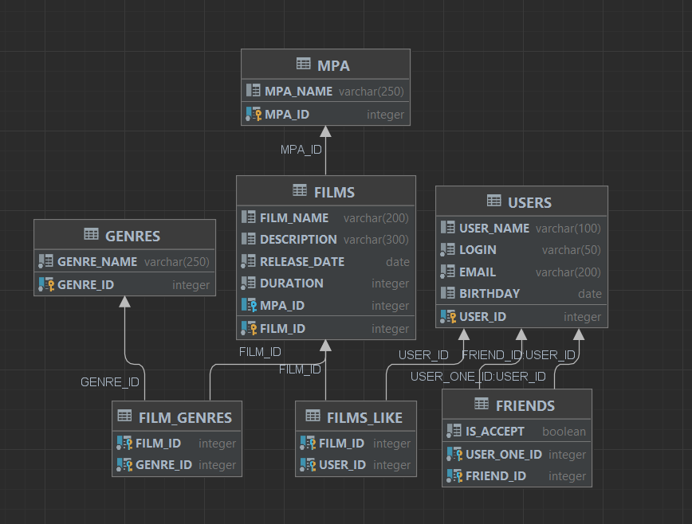

# java-filmorate
Template repository for Filmorate project.

# Database description
## ER diagram:

## DB request examples:

### Get all users:

`SELECT user_id, login, user_name, email, birthday FROM users`

### Get film by ID:

`SELECT * FROM films f LEFT JOIN mpa ON mpa.mpa_id = f.mpa_id WHERE film_id = ?`

### Get most popular films:

`SELECT * FROM films f left join(SELECT film_id, count(*) likes_count  FROM FILMS_LIKE" +
" GROUP BY film_id) l ON f.film_id=l.film_id LEFT JOIN mpa m ON m.mpa_id=f.mpa_id ORDER BY " +
"l.likes_count DESC LIMIT ?`

### Get genres:

`SELECT * FROM genres`